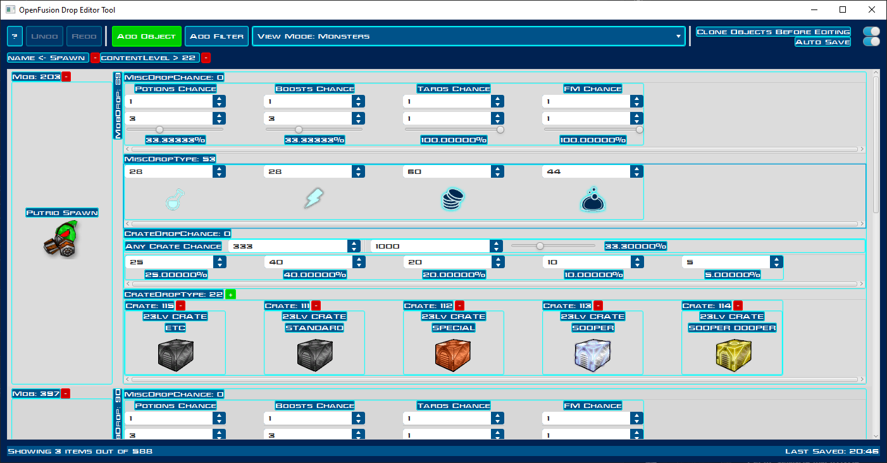
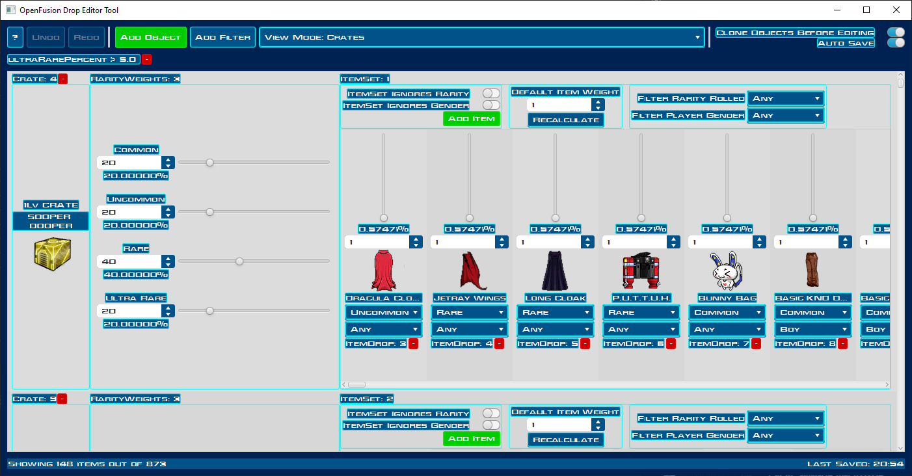

# OpenFusion Drop Editor
A GUI drop editor for OpenFusion and its derivatives. 
Meant for OpenFusion server admins (including local servers) who would like a more pleasant experience while editing the drop settings of the game.

**Note**: The user interface is not final and is open to (much needed) suggestions.

## Instructions
### Installation
Go to Releases and download the latest ZIP release, extract it anywhere and run the JAR file in the directory. 
You shouldn't need a prior Java installation.

### Help
Click, drag and hover over the stuff you see on the screen for more instructions. 
You can also click on the `?` button on screen for more information. 

### Buttons
You will see several clickable things on the display:
- `Redo`/`Undo`: Redo (CTRL+SHIFT+Z) or undo (CTRL+Z) the last action you took.
- The dropdown: Choose which main objects you wish to edit. Anything you don't see in the dropdown is used by some object in the dropdown.
- `Add Object`: Add an object of the type specified in the dropdown.
- `Add Filter`: Filter the objects you see on the screen based on some attribute tied to them.

### Object Cloning
As you edit some objects, you will see the displayed IDs change.
This is because OF DropEditor detects that you edited some object used elsewhere, so it cloned it and replaced it before your edit.
To disable this, turn off the `Clone Objects Before Edit` option. This will allow you to edit objects everywhere.
Do mind that some features like editing crate types are disabled in this mode as they do not make much sense.

### Saves
The program saves periodically to your save directory (once per minute). You can turn this off via the `Auto Save` option. 

What and how it will be saved depends on your save directory and whether you're in _standalone mode_:
- If standalone save was selected, your patches and your edits will be merged and saved together.
  + If your save directory is the drops directory (not recommended), your data will overwrite the existing JSONs there. In this case, you can load the data into the game server without specifying patches.
  + If your save directory is elsewhere, the merged patches and edits will be saved as a new patch there. In this case, edit server config `enabledpatches` to be your save directory to load the data into the game.
- If standalone save was not selected, your patches will not be merged.
  + If the last patch directory is your save directory, you'll be able to redefine (only) that patch with your edits. In this case, edit server config `enabledpatches` to be a comma-separated list of all the patches you loaded to load the data into the game.
  + If not, only your edits will be saved into your save directory as a new patch. In this case, edit server config `enabledpatches` to be a comma-separated list of all the patches you loaded, and add your save folder at the end, to load the data into the game.
  
## Warnings
Make sure you have your edits finalized before closing the program, as the program will forget your edits and will not be able to undo them after you quit.

Make sure you have backups just in case, especially for save modes that overwrite existing data.
